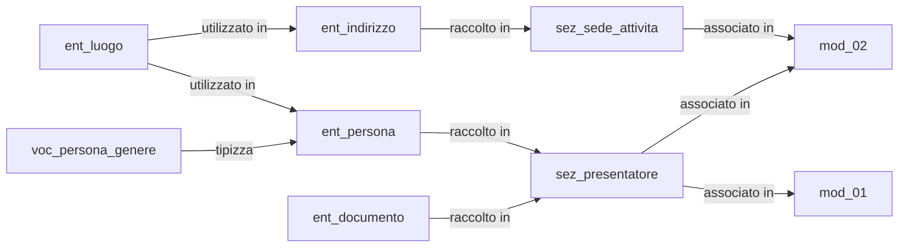

# Readme

Nel presente folder è riportato un esempio di applicazione del organizzazione del data model a 4 livelli di oggetti per la digitalizzaione dei 
moduli unificati e standardizzati, nello specifico l'esempio prevede:

- 1 vocabolario rappresetato in 1 XML Schema
- 4 entità rappresetat1 in 3 XML Schema
- 2 sezioni rappresetat1 in 2 XML Schema e snipped Schematron
- 2 moduli rappresetat1 in 2 XML Schema e Schematron

La seguente figura sintetizza le relazione tra gli oggetti inclusi nell'esempio riportato.

L'organizzazione dei Moduli digitali è riportato al seguente URL https://docs.google.com/document/d/1wdvPEqATysP723o7nQ3nVGWP2zzlZgEPFMFts2bRK-U
