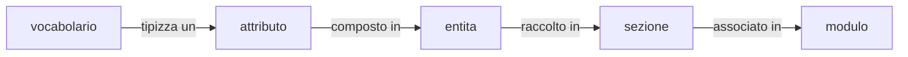

# Esempio di organizzazione del data model 

Si riporta un esempio di organizzazione del data model per la digitalizzaione dei 
moduli unigicati e standandardizzati.

Valgono le seguenti definizioni:

- **regole condivise** sono la rappresentazione digitale dei moduli unigicati e standarizzati 
- **modulo digitale** è una specifica istanza di un modulo unificato e standarsizzato 
- **modulo digitale** è *corretto* se ogni dato in esso presente rispetta i vinxcoli di formato presenti nelle **regole condivise**
- **modulo digitale** è *completo* se i dati in esso presenti sono almeno tutti i quelli obbligatori indicati nelle **regole condivise** 

## Requsiti

I requirement che DEVONO essere soddisfatti sono:

- REQ_01: le **regole condivise** DEVONO esprimere la seguente tipologia di vincoli:
    - tipizzazione dei dati (ad esempio alfanumerico, numerico, booleano, ...) 
    - restrizioni sul tipo dei dati (ad esempio lunghezza minima, rispetto di un'espressione regolare, ...)
    - cadinalità dei dati (ad esempio obbligatorio, ocorrenze massime, ...)
    - dipendenze incrociate tra dati (ad esempio se è popolato il dato D1 allora deve essere popolato il dato D2, ...)
   
- REQ_02: i **moduli digitali** scambiati tra le componenti DEVONO essere *corretti* e *completi*

- REQ_03: dati due **moduli digitali** si DEVONO poter individuare i dati presenti contemporaneamente su essi

- REQ_04: le **regole condivise** DEVONO permettere di assorbire la variazione normative (aggiunto e modifica di molusi unificati e standardizzati)

Si assume l'utilizzo dello stack XML-* nel rispetto delle tecnologie selezionate dal Gruppo Tecnico di cui all'articolo 5 dell'Allegato al DPR 160/2010.
 
## Soluzione

### Organizzazione degli XML Schema e Schematron

Per sodisfare i requisiti indicati il **modello dati** prevede i seguenti oggetti:

- **vocabolari**, rappresentano elenchi di valori ammissibili per una specifica categoria di dati 
- **attributi**, rappresentato uno specifico dato declinato con la tipologia, i vincoli, ed eventualmente il **vocabolario** a cui i valori dello stesso sono vincolati 
- **entità**, rappresenta l'astrazione di un'oggetto della realtà quale aggregazione di **attributi** definiti
- **sezioni**, rappresenta una porzione dei **moduli digitali** quale aggragazione di **entità** e la relativa contestualizzazione
- **moduli**, rappresent un **modulo digitale** quale aggrazione di **sezioni** definite

#### Vocabolari

Un **vocabolario** è definito tramite uno XML Schema che può contenere differenti forme dello stesso **vocabolario**.

Una specifica forma di un **vocabolario** è definito come *simpleType* che estendono il tipo di base *string* limitando i valori ammissibili tramite *enumeration*.

#### Attributi

Gli **attributi** sono definiti tramite XML Schema. 

Un XML Schema contiene la definizione di **attributi** coerenti tra di loto (ad esempio relativo ad una specifica entità).

Un **attributo** è definito come *simpleType* utilizzando la capacità dichiaratori dello stesso costrutto e, ove necessario, tipizzandolo con un **vocabolario** definito.

> WARNING: da valutare la possibilità di prevedere **vocabolari** dinamici in cui i valori ammessi sono forniti da una API specifica

#### Entità

Le **entita** sono definite tramite XML Schema.

Un XML Schema contiene la definizione di una singola **entita**.

Una **entita** è definita come *group* per aggregare gli **attributi** definiti, e per ognuno le cardinalità ammissibili (*minOccurs* e *maxOccurs*), che la compongono.

#### Sezioni

Le **sezioni** sono definite tramite XML Schema e snipped Schematron conenente i pattern da applicare.

Un XML Schema contiene la definizione di una singola **sezione**.

Una **sezione** è definita come *complexType* per aggregare le **entita** definite e, ove necessario, contestuallizzando le stesse alla **sezione**.

Uno snipped Schematron contiene la definizione dei pattern di una singola **sezione**.

I pattern inclusi nello snipped Schematron specializzando le cardinalità delle **entità** incluse nella singola **sezione*.

#### Moduli

I **moduli** sono definite tramite XML Schema e Schematron.

Un XML Schema contiene la definizione di un singolo **modulo**.

Un **modulo** è definita come *complexType* per aggregare le **sezioni** definite e, ove necessario, contestuallizzando le stesse al **modulo**.

Uno Schematron contiene la definizione dei pattern di una singola **sezione**.

I pattern inclusi nello Schematron definisco le dipendenze incrociate caratterizzandi il **modulo**.

### Ciclo di vita degli XML Schema e Schematron

Tutti le rappresentazioni degli oggetti, XML Schema e Schematron, indicati in precedenza sono versionate.

La seguente sigura riassume le dipendenze tra gli oggetti che definiscono il data model.

#### Inserimento di un oggetto

L'inserimento di un nuovo oggetto richiede che tutti gli oggetti di livello inferiore siano definiti. Ad esempio l'inserimento di una **entita** richiede che tutti gli **attributi** da essa composto siano definiti.

#### Modifica di un oggetto

La modifica di un oggetto determina l'aggiornamento della propria versione e di tutte gli oggetti di livello superiore che la contengono. Ad esempio l'aggiornamento di una **entita** determina il cambio della propria versione e delle **sezioni** che la raccolgono.

Nel dettaglio per un corretto aggiornamento delle versioni delle rappresentazioni degli oggetti è necessario assicurare che:

1. se si aggiorna un **modulo** modificando il relativo XML Schema DEVE aggiornarsi la versione dello stesso XML Schema
2. se si aggiorna un **modulo** modificando il relativo Schematron DEVE aggiornarsi la versione dello stesso Schematron
3. se si aggiorna una **sezione** modificando il relativo XML Schema DEVE aggiornarsi la versione dello stesso XML Schema e dei **moduli** in cui la **sezione** è associtata (si applica per tutti i **moduli** interessati il precedent punto 1)
3. se si aggiorna una **sezione** modificando il relativo snipped Schematron DEVE aggiornarsi la versione dello snipped Schematron e gli Schematron dei **moduli** in cui la **sezione** è associtata (si applica per tutti i **moduli** interessati il precedent punto 2)
4. se si aggiorna una **enita** modificando il relativo XML Schema DEVE aggiornarsi la versione dello stesso XML Schema e delle **sezioni** in cui la **enita** è raccolta (si applica per tutti le **sezioni** interessati il precedent punto 3)
5. se si aggiorna un **attributo** modificando il relativo XML Schema DEVE aggiornarsi la versione dello stesso XML Schema e delle **entita** in cui lo **attributo** è composto (si applica per tutte le **entita** interessate il precedent punto 4)
6. se si aggiorna un **vocabolario** modificando il relativo XML Schema DEVE aggiornarsi la versione dello stesso XML Schema e degli **attributi** tipizzati dal  **vocabolario** (si applica per tutti gli **attributi** interessati il precedent punto 5)

#### Cancellazione di un oggetto
La cancellazione di un oggetto è possibile solo se non esistono oggetti di livello superiori che lo utilizzano. Ad esempio la cancellazione di una **entita** richiede che non vi siano **sezioni** che la utilizzano.